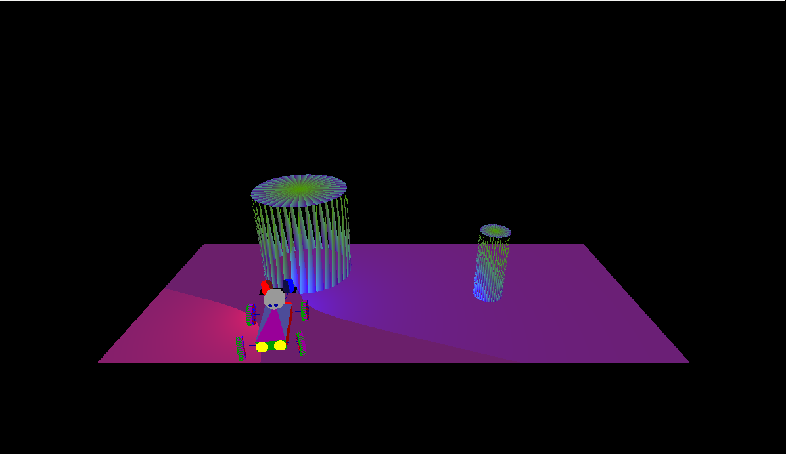
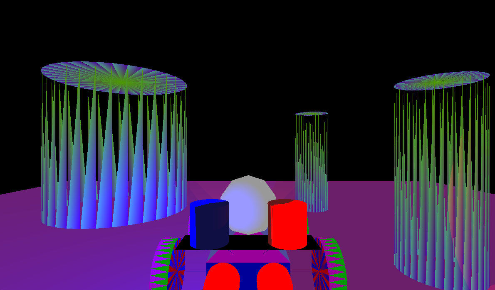

# LightMotionGLDemo
A game demonstrating handling light, motion, and cameras in OpenGL

It has dependencies on freeglut (https://freeglut.sourceforge.net/), glew32 (https://glew.sourceforge.net/basic.html), and a library written by Edward Angel (https://www.cs.unm.edu/~angel/BOOK/INTERACTIVE_COMPUTER_GRAPHICS/SIXTH_EDITION/) used in Computer Graphics course.  It was developed for school project in 2011.

Controls:  

 - x key rotates head right  
 - z key rotates head left 
 - space key stop the car  
 - 0 through 9 sets speed of the car  
 - c key changes camera view STATIC, VIEW, CHASE  
 - r key resets the game  
 - a key zooms in lens in STATIC view  
 - s key zooms out lens in STATIC view  
 - q key zooms in position in STATIC view  
 - w key zooms out position in STATIC view
 - f key switches focus between center of the map and the car    
 - h key switches the headlights on and off  
 - l key switches emergency lights and off  

Screenshots:  

- First-person view with the headlights on.

  
 - Static view with the headlights on.
   

 - Static view with the headlights and emergency lights on.

 - Another static view with the headlights and emergency lights on.

 - Static view with the lights off.

 - Another static view with the headlights on.

 - Chase view with the emergency lights on.

 - Chase view with headlights on.

 - Static view with zoom out position focused on center of the map

   

 - Static view with zoom out position focused on the car

   

 - This is a video from original development  
[Watch on YouTube](https://youtu.be/9urreEvLEsw)  

   
